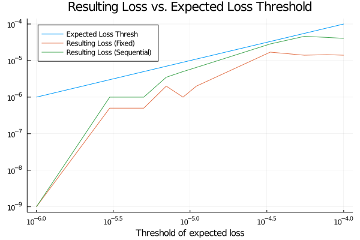
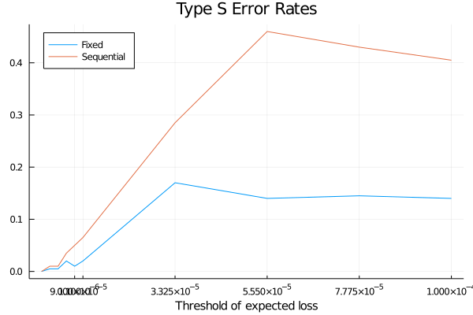

# Type S Error in Fixed Horizon and Sequential Testing Experiment

A Type S error is an error of *sign* when our claimed sign of parameter is to the opposite of the truth. See detailed discussion in this [blog article](https://statmodeling.stat.columbia.edu/2004/12/29/type_1_type_2_t/) and [paper](http://www.stat.columbia.edu/~gelman/research/published/francis8.pdf).

This example is taken from the post [Is Bayesian A/B Testing Immune to Peeking? Not Exactly](http://varianceexplained.org/r/bayesian-ab-testing/), which discusses about the impact of experiment design, fixed horizon or sequential design, on the Type S error rate.


```julia
# setup noteoobk environment
import Pkg
Pkg.activate(".")
Pkg.instantiate();

using Random
using Plots

using BayesianExperiments
```

Suppose we have one new feature and we want to compare it to the old one.
And the new feature will actually decrease our clickthrough rate from $0.1%$ to $.09%$.
We can use two Bernoulli distributions to represent the data generating processes.


```julia
θ1 = 0.0010
θ2 = 0.0009
datagendistA = Bernoulli(θ1)
datagendistB = Bernoulli(θ2)
datagendists = [datagendistA, datagendistB];
```

We start our model with priors $α=10$ and $β=90$.


```julia
α = 10
β = 90
modelA = ConjugateBernoulli(α, β)
modelB = ConjugateBernoulli(α, β)
models = [modelA, modelB]
modelnames = ["old", "new"];
```

We want to use "expected loss" as the key metric for our decision, and a "threshold of caring" of 0.00001 as the stopping rule of our experiment.


```julia
thresh = 0.00001
stoppingrule = ExpectedLossThresh(thresh);
```

Now we can setup the experiment. 


```julia
experiment = ExperimentAB(models, stoppingrule, modelnames=modelnames);
```

## Fixed Horizon

We can run simulation to analyze how will this experiment perform in reality. 
For the first simulation, we want to use a fixed horizon that 
we only see the result once after 20 days, and make decision at that point.


```julia
simulation_fix = Simulation(
    experiment=experiment,
    datagendists=datagendists,
    maxsteps=20,
    onestepsizes=[10000, 10000],
    minsteps=20
)

Random.seed!(123)
numsteps, winners, metricvals = runsequential(simulation_fix, numsamples=10000, numsims=100)
println("Ratio of new variant wins:", sum(winners .== "new") / 100)
```

    Ratio of new variant wins:0.02


## Sequential Experiment

For the second simulation, we want to use sequential decision that 
we will check the result at the end of each day


```julia
simulation_sequential = Simulation(
    experiment=experiment,
    datagendists=datagendists,
    maxsteps=20,
    onestepsizes=[10000, 10000],
    minsteps=1
)

Random.seed!(124)
numsteps, winners, metricvals = runsequential(simulation_sequential, numsamples=10000, numsims=100)
type_s_error_rate = sum(winners .== "new") / 100
println("Ratio of new variant wins:", type_s_error_rate)
```

    Ratio of new variant wins:0.11


## Expected Loss Thresholds vs. Resulting Loss


```julia
thresholds = [collect(range(1e-6, 9e-6, length=5)); collect(range(1.1e-5, 1e-4, length=5))];
```


```julia
α = 100
β = 99900
modelA = ConjugateBernoulli(α, β)
modelB = ConjugateBernoulli(α, β)
models = [modelA, modelB]
modelnames = ["old", "new"];
```


```julia
resulting_losses_fixed = Float64[]
type_s_error_rates_fixed = Float64[]

numsims = 200
Random.seed!(12)
for thresh in thresholds
    stoppingrule = ExpectedLossThresh(thresh)
    experiment = ExperimentAB(models, stoppingrule, modelnames=modelnames)
    simulation = Simulation(
        experiment=experiment,
        datagendists=datagendists,
        maxsteps=20,
        onestepsizes=[10000, 10000],
        minsteps=20
    )
    numsteps, winners, metricvals = runsequential(simulation, numsamples=5000, numsims=numsims)
    type_s_error_rate = sum(winners .== "new") / numsims
    resulting_loss = (θ1 - θ2)*type_s_error_rate
    push!(type_s_error_rates_fixed, type_s_error_rate)
    push!(resulting_losses_fixed, resulting_loss)
    @show thresh, resulting_loss, type_s_error_rate, thresh > resulting_loss
end
```

    (thresh, resulting_loss, type_s_error_rate, thresh > resulting_loss) = (1.0e-6, 0.0, 0.0, true)
    (thresh, resulting_loss, type_s_error_rate, thresh > resulting_loss) = (3.0e-6, 5.000000000000002e-7, 0.005, true)
    (thresh, resulting_loss, type_s_error_rate, thresh > resulting_loss) = (5.0e-6, 5.000000000000002e-7, 0.005, true)
    (thresh, resulting_loss, type_s_error_rate, thresh > resulting_loss) = (7.0e-6, 2.0000000000000008e-6, 0.02, true)
    (thresh, resulting_loss, type_s_error_rate, thresh > resulting_loss) = (9.0e-6, 1.0000000000000004e-6, 0.01, true)
    (thresh, resulting_loss, type_s_error_rate, thresh > resulting_loss) = (1.1e-5, 2.0000000000000008e-6, 0.02, true)
    (thresh, resulting_loss, type_s_error_rate, thresh > resulting_loss) = (3.325e-5, 1.700000000000001e-5, 0.17, true)
    (thresh, resulting_loss, type_s_error_rate, thresh > resulting_loss) = (5.55e-5, 1.4000000000000008e-5, 0.14, true)
    (thresh, resulting_loss, type_s_error_rate, thresh > resulting_loss) = (7.775e-5, 1.4500000000000005e-5, 0.145, true)
    (thresh, resulting_loss, type_s_error_rate, thresh > resulting_loss) = (0.0001, 1.4000000000000008e-5, 0.14, true)


```julia
resulting_losses_sequential = Float64[]
type_s_error_rates_sequential = Float64[]

numsims=200
Random.seed!(12)
for thresh in thresholds
    stoppingrule = ExpectedLossThresh(thresh)
    experiment = ExperimentAB(models, stoppingrule, modelnames=modelnames)
    simulation = Simulation(
        experiment=experiment,
        datagendists=datagendists,
        maxsteps=20,
        onestepsizes=[10000, 10000],
        minsteps=1
    )
    numsteps, winners, metricvals = runsequential(simulation, numsamples=4000, numsims=numsims)
    type_s_error_rate = sum(winners .== "new") / numsims
    resulting_loss = (θ1 - θ2)*type_s_error_rate
    push!(type_s_error_rates_sequential, type_s_error_rate)
    push!(resulting_losses_sequential, resulting_loss)
    @show thresh, resulting_loss, type_s_error_rate, thresh > resulting_loss
end
```

    (thresh, resulting_loss, type_s_error_rate, thresh > resulting_loss) = (1.0e-6, 0.0, 0.0, true)
    (thresh, resulting_loss, type_s_error_rate, thresh > resulting_loss) = (3.0e-6, 1.0000000000000004e-6, 0.01, true)
    (thresh, resulting_loss, type_s_error_rate, thresh > resulting_loss) = (5.0e-6, 1.0000000000000004e-6, 0.01, true)
    (thresh, resulting_loss, type_s_error_rate, thresh > resulting_loss) = (7.0e-6, 3.500000000000002e-6, 0.035, true)
    (thresh, resulting_loss, type_s_error_rate, thresh > resulting_loss) = (9.0e-6, 5.000000000000003e-6, 0.05, true)
    (thresh, resulting_loss, type_s_error_rate, thresh > resulting_loss) = (1.1e-5, 6.500000000000003e-6, 0.065, true)
    (thresh, resulting_loss, type_s_error_rate, thresh > resulting_loss) = (3.325e-5, 2.8500000000000012e-5, 0.285, true)
    (thresh, resulting_loss, type_s_error_rate, thresh > resulting_loss) = (5.55e-5, 4.600000000000002e-5, 0.46, true)
    (thresh, resulting_loss, type_s_error_rate, thresh > resulting_loss) = (7.775e-5, 4.300000000000002e-5, 0.43, true)
    (thresh, resulting_loss, type_s_error_rate, thresh > resulting_loss) = (0.0001, 4.050000000000002e-5, 0.405, true)


From the plot below we can find the resulting loss is always below the threshold set in our stopping rule.


```julia
#Adding a small number to 0's to support log-scale plots.
mask = resulting_losses_fixed .== 0.0
resulting_losses_fixed[mask]  .= 1e-9
mask = resulting_losses_sequential .== 0.0
resulting_losses_sequential[mask]  .= 1e-9

plot(thresholds, 
    [thresholds, resulting_losses_fixed, resulting_losses_sequential], 
    xaxis=:log, 
    yaxis=:log, 
    title="Resulting Loss vs. Expected Loss Threshold",
    label=["Expected Loss Thresh" "Resulting Loss (Fixed)" "Resulting Loss (Sequential)"],
    legend=:topleft, 
    xlabel="Threshold of expected loss",
    xguidefontsize=10
)
```


    

    


The Type S error in the sequential experiment is more sensitive to the threshold we chose. As you can see from the plot below, the Type S error increases rapidly when the threshold gets bigger.


```julia
plot(thresholds, 
    [type_s_error_rates_fixed, type_s_error_rates_sequential], 
    title="Type S Error Rates",
    label=["Fixed" "Sequential"],
    legend=:topleft,
    xticks=thresholds[5:end],
    xlabel="Threshold of expected loss",
    xguidefontsize=10
)
```


    

    


